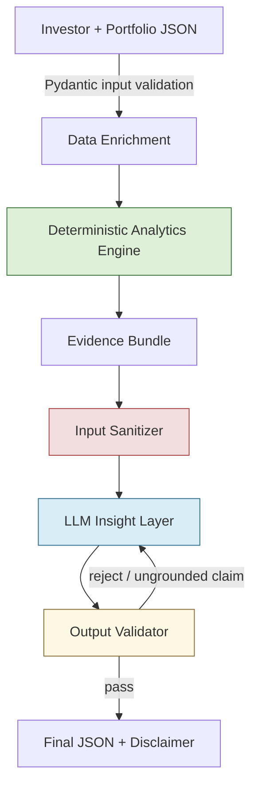

# Mutual Fund Portfolio Intelligence System

A prototype built for the RupeeStop AI Engineer assignment. Given an investor's
profile and mutual fund holdings, it answers one question:

> **"What are the most important things this investor should know about their
> mutual fund portfolio, and why?"**

No frontend, no chat UI — a CLI pipeline that turns raw holdings into a small,
prioritized, evidence-backed set of insights, with a hard rule underneath all
of it: **the LLM never does arithmetic.** Every number that can appear in an
insight is computed once, in plain Python, before the LLM (or its deterministic
fallback) ever sees it — and every number the LLM writes is checked against
that computed evidence before it's allowed out the door.

---

## Quick start

```bash
git clone <this-repo>
cd mf_portfolio_intelligence_system
pip install pydantic numpy-financial openai reportlab pytest

# optional - enables LLM-drafted insights instead of the deterministic
# template fallback (see "About the LLM layer" below)
export OPENAI_API_KEY=sk-...          # macOS/Linux
$env:OPENAI_API_KEY = "sk-..."        # Windows PowerShell
set OPENAI_API_KEY=sk-...             # Windows cmd.exe

python run.py                         # runs all 4 sample portfolios
python run.py --portfolio-no PF-1001  # just one
python run.py --portfolio path/to/your_portfolio.json
python run.py --summary-only          # titles only, no full explanations
python run.py --no-pdf                # skip PDF generation

python -m pytest tests/ -v            # 30 tests
```

Every run writes `output/results.json` (full structured output) and
`output/portfolio_report.pdf` (readable report). No API key is required to
get a working result — see below.

---

## About the LLM layer

If `OPENAI_API_KEY` is set and reachable, insight drafting runs through OpenAI
(`gpt-4o-mini`). If it isn't set, or the call fails for any reason, the
pipeline **automatically falls back to a deterministic, template-based insight
generator** — same output schema, same guarantees, zero LLM involved. This
isn't a stub: it's a real path, exercised by the test suite
(`test_fallback_insights_are_always_grounded`), and every explanation in that
path is built directly from computed evidence-bundle fields, so there's
nothing in it to hallucinate.

⚠️ **Never commit an API key.** Set it as an environment variable only. This
repo's `.gitignore` excludes `.env`, and no key should ever appear inside a
`.py` file.

---

## Architecture

```
Investor + Portfolio JSON (Pydantic input validation)
        │
        ▼
Data Enrichment (curated risk-grade seed file, keyed by scheme code)
        │
        ▼
Deterministic Analytics Engine   ← pure Python, zero LLM calls
   allocation • HHI concentration • category overlap • XIRR • suitability checks
        │
        ▼
Evidence Bundle (Pydantic schema — the ONLY thing the LLM layer is allowed to see)
        │
        ▼
Input Sanitizer (strips prompt-injection patterns from free-text notes)
        │
        ▼
LLM Insight Layer (OpenAI, draft → validate → retry-once → fallback)
   ranks, explains, personalizes — never computes a number
        │
        ▼
Output Validator (schema check + numeric groundedness check against evidence bundle)
        │
        ▼
Final structured JSON + disclaimer (always appended, never LLM-authored)
```



**File map**

| Path | What it does |
|---|---|
| `app/schemas.py` | Three Pydantic schemas: input, evidence bundle, output |
| `app/analytics.py` | All financial calculations — no LLM involved anywhere |
| `app/evidence.py` | Wires the analytics output into the evidence bundle |
| `app/sanitizer.py` | Prompt-injection filter for free-text fields |
| `app/llm_layer.py` | OpenAI call + deterministic fallback + retry-on-failed-validation |
| `app/validator.py` | Groundedness check — every cited number must exist in the evidence bundle |
| `data/risk_seed.json` | Curated risk grades for the schemes in the sample data |
| `data/sample_portfolios.json` | 4 distinct sample investors (see below) |
| `run.py` | CLI entrypoint |
| `report.py` | Renders `output/results.json` into a PDF |
| `tests/` | 30 pytest cases across analytics, schemas, and security |

---

## Sample data

Four different investors, not four copies of one template — each one exercises
a different edge case:

| Portfolio | Investor | Profile | Edge case exercised |
|---|---|---|---|
| `PF-1001` | Priya Sharma, 29 | Aggressive, wealth creation, 20yr horizon | Fund-level concentration (one small-cap fund ~56% of book) |
| `PF-1002` | Rajesh Kumar, 52 | Conservative, retirement, 6yr horizon | Risk-appetite vs. concentration mismatch |
| `PF-1003` | Ananya Verma, 35 | Moderate, child's education, 12yr horizon | Missing `investment_date` → XIRR gracefully skipped |
| `PF-1004` | Vikram Singh, 41 | Moderate-aggressive, wealth creation, 15yr horizon | Category overlap across 3 large-cap funds from different AMCs |

Every input portfolio requires: `portfolio_no`, `investor_name`, `age`, `goal`,
`horizon_years`, `risk_appetite`, `monthly_investment_capacity`, and at least
one holding. Missing any of these fails validation immediately with a clear
error — the system never silently analyzes on defaults.

---

## Deterministic vs. LLM — the core design decision

| Deterministic (`analytics.py`) | LLM / template layer (`llm_layer.py`) |
|---|---|
| Allocation % by category and asset class | Deciding which computed findings matter most for *this* investor |
| HHI concentration score | Explaining *why* a number matters, in plain language |
| Category-overlap detection | Personalizing to age, goal, horizon, risk appetite |
| XIRR / absolute return, per holding and portfolio-wide | Turning several findings into a short, prioritized list |
| Suitability rule checks (horizon vs. equity %, risk vs. concentration) | Nothing else — it has no path to introduce a number it wasn't handed |

The LLM's only input is the serialized evidence bundle. Its output is checked,
number by number, against that same bundle before anything ships. If it cites
a figure that isn't there, the output is rejected, retried once with the
specific problem fed back, and if it still fails, the system falls back to the
deterministic template path rather than shipping a maybe-wrong answer.

---

## Reliability & security

| Situation | Behavior |
|---|---|
| Compulsory field missing | Rejected at the schema layer, clear error, never defaulted |
| Holding missing `investment_date` | XIRR skipped for that holding only, reason recorded, still counted in allocation |
| Scheme not in the risk-grade seed file | Risk grade omitted, not guessed; flagged as a data-quality issue |
| XIRR solver doesn't converge | Returns `None` with a reason, never a nonsense rate |
| LLM cites an ungrounded number | Rejected → one retry → fallback to template |
| Prompt injection in investor notes | Sanitizer pattern-matches and drops the field before it reaches the LLM |
| No/invalid API key, or the API call fails | Falls back to the deterministic template automatically, warning recorded |
| Single-holding portfolio | Runs cleanly, HHI correctly reports 100% concentration |
| Empty holdings list | Rejected at schema validation |

**Market risk disclaimer** is a fixed constant appended by the output
validator on every response — never phrased or generated by the LLM, so it
can't be dropped, reworded, or watered down by a bad generation.

**Not handled in this prototype, stated rather than hidden:** true
holdings-level fund overlap (needs constituent-level data, out of scope for a
prototype — category-level overlap is used as a labeled proxy instead), and
live NAV fetching (market values are taken as input-supplied).

---

## Evaluation

```bash
python -m pytest tests/ -v
```

- `test_analytics.py` — every calculation (HHI, overlap, XIRR, allocation,
  gain %) checked against hand-worked expected values, not just "does it run"
- `test_schemas.py` — malformed/incomplete input rejected at the schema
  boundary
- `test_validation_and_security.py` — groundedness check catches a
  deliberately planted fabricated number, fallback insights are provably
  always grounded, and the injection sanitizer strips several attack shapes
  without touching benign notes

30 tests, all passing. Latency is logged per run (`elapsed_seconds` in
`output/results.json`) — the fallback path runs in single-digit milliseconds
since it makes no network call.

---

## Trade-offs worth knowing about

- **No RAG layer.** Scoped in the original plan, cut deliberately: the sample
  portfolios don't need factsheet text to answer "what should this investor
  know," a vector store for ~13 schemes is disproportionate infrastructure for
  a prototype, and the assignment explicitly warns that more AI machinery
  isn't automatically better.
- **Overlap detection is category-level, not holdings-level**, and is labeled
  as a proxy in the code itself rather than presented as more than it is.
- **Fund-level HHI, not category-level** — a portfolio can look diversified
  by category while still being concentrated in one fund pick; fund-level HHI
  catches that, category-level would miss it.
- **Retry-once-then-fallback, not retry-forever.** A tool that silently keeps
  retrying and eventually ships a maybe-wrong answer is worse than one that
  visibly degrades to a known-safe deterministic path.

---

## License

Prototype built for a hiring assignment — not licensed for production use.
# Mutual-fund-portfolio-intelligence-system
